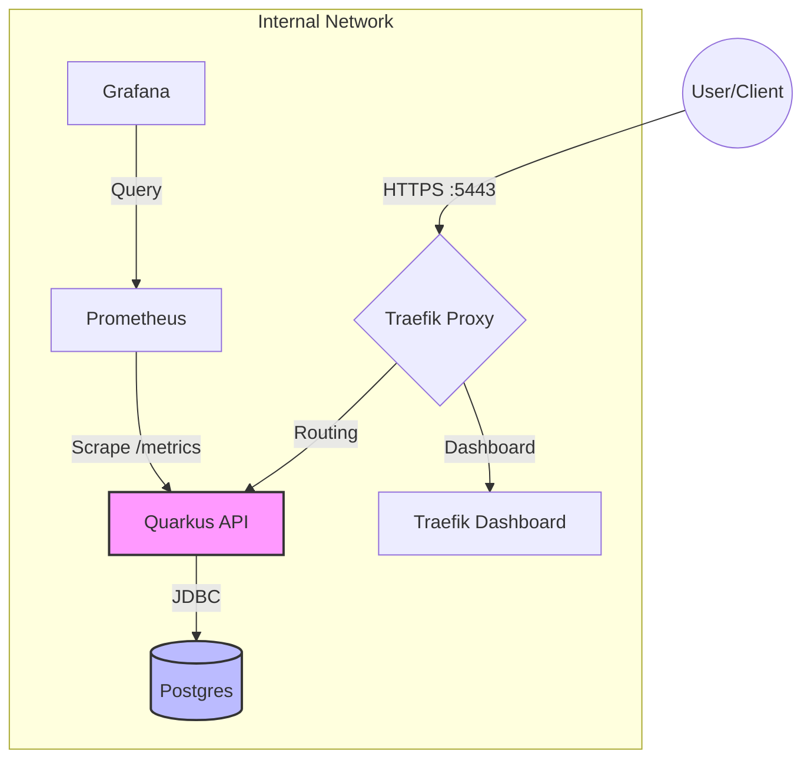
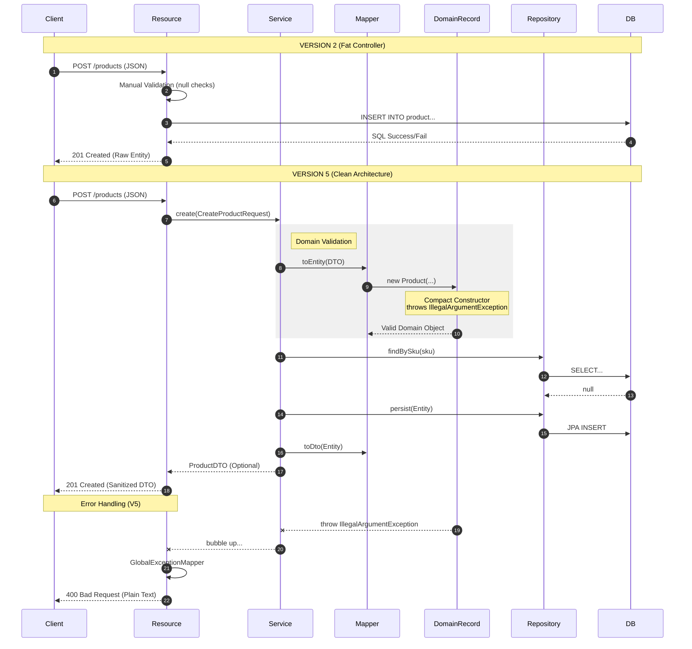
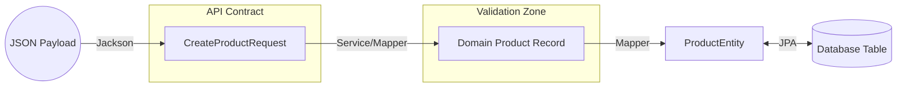

# Learning Guide — Java REST Quarkus Product Catalog (Progressive Concepts)

This repository is an incremental, illustrative Quarkus-based product catalog that demonstrates progressive API and architecture concepts across multiple versions. Use this guide to explore the codebase systematically, understand the evolution of design choices (API versioning, DTOs, mapping, persistence, service refactoring), and practice extension exercises.

## Learning Objectives

- Understand progressive API design and versioning strategies.
- Observe separation of concerns: API layer, DTOs, mappers, domain, persistence, services.
- Learn how to refactor services and repositories across iterations.
- Explore Quarkus development & packaging (dev mode, JVM packaging, native image artifact present).
- Examine project containerization and integration with Postgres, Traefik, Prometheus, and Grafana in compose files.

## Minimal requirements

- Docker & Docker Compose for running the full stack (Postgres, App, Traefik, Prometheus, Grafana).

## Ultraquick Start

Use the one-liner below to run the full stack (Postgres + App + Traefik + Prometheus + Grafana) with Docker Compose.

```bash
curl -sSL https://raw.githubusercontent.com/ebpro/notebook-java-rest-sample-quarkus/develop/compose.yml | \
    docker compose -f - up -d
```

and use the API :

```bash
# Add two products to the catalog
curl -v -X POST http://localhost:8080/api/v5/products \
  -H "Content-Type: application/json" \
  -d '{
    "sku": "P001",
    "name": "Produit 1",
    "price": 50.0,
    "stock": 500
  }'

curl -v -X POST http://localhost:8080/api/v5/products \
  -H "Content-Type: application/json" \
  -d '{
    "sku": "P002",
    "name": "Produit 2",
    "price": 578.0,
    "stock": 100
  }'

# Retrieve the list of products and a single product by SKU
curl -v -X GET http://localhost:8080/api/v5/products \
  -H "Accept: application/json"

curl -v -X GET http://localhost:8080/api/v5/products/P001 \
  -H "Accept: application/json"
```

## Quick Start

1. Clone the repository.
2. Use compose files to run the full stack (Postgres + App + Traefik + Prometheus + Grafana)

```bash
docker compose -f compose.prod.yml \
    --profile monitoring up -d
```

## Development Requirements

- Java 21+ (as required by Quarkus in this project). Verify `./mvnw -v`.
- Docker & Docker Compose for full integration stack (Postgres, Traefik, Prometheus, Grafana).

## Building and testing the application

To run the tests (unit and integration tests) use :

```bash
./mvnw clean verify
```

no need to start the database or the application, the tests will use a postgres container started automatically by `Testcontainers` library and stopped after the tests complete.

## Running the application

We will explore different ways to run the application, starting with running the database in Docker and the application locally in dev mode, then running both the database and the application in Docker, and finally running the full stack with Traefik and monitoring.

### Run the database in Docker and the application locally (dev mode or packaged)

Run the application in Quarkus dev mode (recommended while exploring and developing) :

Set the minimal environment variables to share configuration between the app and the database container:

```bash
export DB_NAME=products
export DB_USER=tpuser
export DB_PASSWORD=Tp@2026
export DB_HOST=localhost
export DB_PORT=15432
export HOST_POSTGRES_PORT=15432
export HOST_HTTP_PORT=8080
```

start a Postgres instance :

```bash
docker run --name product-catalog-postgres \
    -e POSTGRES_DB=$DB_NAME \
    -e POSTGRES_USER=$DB_USER \
    -e POSTGRES_PASSWORD=$DB_PASSWORD \
    -p $HOST_POSTGRES_PORT:5432 \
    -d postgres:16-alpine
```

then run Quarkus in dev mode with Maven :

```bash
./mvnw quarkus:dev
```

or with the Quarkus CLI if installed (see <https://quarkus.io/guides/cli-tooling>) :

```bash
quarkus dev
```

You can now use :

- The interactive Swagger UI at `http://localhost:8080/q/swagger-ui` to explore the API endpoints and their documentation. The Quarkus dev mode will automatically reload the application when you make changes to the code.
- The Quarkus Web console at `http://localhost:8080/q/dev` for monitoring and managing the application during development.

If you open the project in an IDE (e.g., IntelliJ, VSCode) you can use [products.http](products.http) for sample requests.
check the `@baseUrl` variable at the top to switch between environments.

To run the application in production mode, first build the optimized JVM package :

```bash
./mvnw package -DskipTests
```

**The jar is built with Production-ready optimizations (no dev tools). It is not intended for development use (no hot reload, no dev tools, no debug support). Use the `quarkus:dev` mode for development. The UI and OpenAPI docs are also not included, they are only available in dev mode.**

The library dependencies are included in the `quarkus-app/lib/` directory, so to distribute the application you can simply copy the entire `quarkus-app/` directory to the target environment and run the JAR from there.

```bash
cp target/quarkus-app/ -r /tmp/target-environment/
java -jar /tmp/target-environment/quarkus-run.jar
```

When done, stop and clean up the Postgres container with:

```bash
docker stop product-catalog-postgres
docker rm product-catalog-postgres
```

## Run both the database and the application in Docker

Set the minimal environment variables:

Note: here `DB_HOST` is set to the Docker container name `product-catalog-postgres` since both containers will be in the same Docker network.
and that the `DB_PORT` is the internal container port (5432) while `HOST_POSTGRES_PORT` is the host machine port mapped to it (to be used in the host machine to connect to the database).

```bash
export DB_NAME=products
export DB_USER=tpuser
export DB_PASSWORD=Tp@2026
export DB_HOST=product-catalog-postgres
export DB_PORT=5432
export HOST_POSTGRES_PORT=15432
export HOST_HTTP_PORT=8080
export NETWORK_NAME=product-catalog-network
```

create the Docker network:

```bash
docker network create $NETWORK_NAME
```

start a Postgres instance in this same network:

```bash
docker run --name $DB_HOST \
    -e POSTGRES_DB=$DB_NAME \
    -e POSTGRES_USER=$DB_USER \
    -e POSTGRES_PASSWORD=$DB_PASSWORD \
    -p $HOST_POSTGRES_PORT:$DB_PORT \
    --network $NETWORK_NAME \
    -d postgres:16-alpine
```

You can now build a container image for the application and run it in the same network to connect to the database container. We use the profile `jvm` to build an optimized JVM package with JIB (it take times). This package will generate a multistage build to produce a layered Docker image without needing a Dockerfile. It will be tagged as `brunoe/product-catalog:1.0.0-jib` by default (you can change the tag in the `pom.xml` if needed).

```bash
./mvnw clean package -Pjvm
```

See the image `brunoe/product-catalog:1.0.0-jib` created :

```bash
docker image ls brunoe/product-catalog:1.0.0-jib
```

**The image is build with Production-ready optimizations (layered, no dev tools, optimized JVM settings). It is not intended for development use (no hot reload, no dev tools, no debug support). Use the `quarkus:dev` mode for development and the JIB image for production or integration testing. The UI and OpenAPI docs are also not included in the JIB image, they are only available in dev mode.**

run it with:

```bash
docker run --name product-catalog-jvm \
    -e DB_NAME=$DB_NAME \
    -e DB_USER=$DB_USER \
    -e DB_PASSWORD=$DB_PASSWORD \
    -e DB_HOST=$DB_HOST \
    -e DB_PORT=$DB_PORT \
    -p $HOST_HTTP_PORT:8080 \
    --network $NETWORK_NAME \
    -d brunoe/product-catalog:1.0.0-jib
```

stop and clean up the Postgres container, the app container, and the network when done:

```bash
docker stop product-catalog-postgres
docker rm product-catalog-postgres
docker stop product-catalog-jvm
docker rm product-catalog-jvm
docker network rm product-catalog-network
```

### Run the full stack with Docker Compose

The same stack can be managed with Docker Compose.

First clean up the variables that may interfere with Compose. `compose.yml` define the required environment variables internally, they can be overriden via a `.env` file if needed (see the provided `.env.example`).

So first **remove the environment variables from the current shell session to avoid conflicts with Compose**:

```bash
unset DB_NAME
unset DB_USER
unset DB_PASSWORD
unset DB_HOST
unset DB_PORT
unset HOST_POSTGRES_PORT
unset HOST_HTTP_PORT
unset NETWORK_NAME
```

Bring up the minimal stack (Postgres and the application) with Docker Compose (default `compose.yml`):

```bash
docker compose up -d
```

The database and the application will be available at the same ports as above (Postgres on `localhost:15432` and the app on `localhost:8080`).

list the running containers with:

```bash
docker compose ps
```

The stack can be stopped (keeping data) with:

```bash
docker compose down
```

and started again with:

```bash
docker compose up -d
```

the stack can be removed completely (including volumes) with:

```bash
docker compose down -v
```

### (OPTIONAL) Run the full stack with Traefik and monitoring - ADVANCED

Finally we will bring up the full stack with Traefik and monitoring in production.
The stack will start the app and the database as before, but also Traefik as a reverse proxy in front of the app, and Prometheus + Grafana for monitoring.
The reverse proxy will route requests to the app based on the hostname (`products.localhost` for HTTP and `products.localhost:5443` for HTTPS) and will also handle TLS termination with a self-signed certificate (defined in `traefik/dynamic/dynamic.yml`). Prometheus is a monitoring system that will scrape metrics from the app and store them, while Grafana is a visualization tool that will connect to Prometheus and display dashboards.

In real deployments, proper DNS records and valid TLS certificates should be used. For this local setup, we need to tweak the `/etc/hosts` file (or equivalent) to map the custom hostnames to `localhost` for testing purposes (you need to be root or use sudo **BE CAREFUL, you can break your system if you edit this file incorrectly**). Add the following lines to your `/etc/hosts` file to simulate DNS for local testing:

```bash
127.0.0.1 products.localhost
127.0.0.1 traefik.products.localhost
127.0.0.1 prometheus.products.localhost
127.0.0.1 grafana.products.localhost
```

We will need certificates, so we can generate self-signed certificates with the provided script (they will be located in the `traefik/dynamic/certs` directory):

```bash
./traefik/generate-self-signed-certs.sh
```

start the full stack with:

```bash
docker compose -f compose.prod.yml --profile monitoring up -d
```

A profile named `monitoring` is used to include the Prometheus and Grafana services. They are optional and can be excluded if not needed (just omit the `--profile monitoring` part).

The application will be accessible through Traefik at the custom hostnames (n) :

```bash
curl --cacert traefik/dynamic/certs/cert.pem \
   -v \
   -X GET \
   https://products.localhost:5443/api/v1/products
```

It will be available at `https://products.localhost:5443` (note the HTTPS and port 5443, Traefik routing to the app with TLS).

Traefik's dashboard will be available at `https://traefik.products.localhost:5443` with basic auth enabled (username: admin, password: admin).
You must create the password file in `./traefik/secrets/traefik-users` with the following content:

```bash
admin:$2y$05$bq5./xN9KVQtwvHpYayPiOC9fTKt2DVCGo9Y9GHtiv8GCEBBMUpjG
```

or generate it with the `htpasswd` command:

```bash
mkdir -p traefik/secrets
htpasswd -nbm admin admin > ./traefik/secrets/traefik-users
```

the credentials are hashed using the Apache MD5 algorithm (the provided password hash corresponds to `admin`).

Prometheus and Grafana will also be available at `https://prometheus.products.localhost:5443` and `https://grafana.products.localhost:5443` respectively, with basic auth enabled.

L'application expose des métriques Prometheus à l'endpoint `/metrics` (ex: `https://products.localhost:5443/metrics`) que Prometheus va scraper pour collecter les données de monitoring. Grafana se connecte à Prometheus pour visualiser ces données à travers des dashboards personnalisés.

La stack peut être arrêtée avec :

```bash
docker compose -f compose.prod.yml down
```

et supprimée complètement (y compris les volumes) avec :

```bash
docker compose -f compose.prod.yml down -v
```



## Key files to inspect about build and architecture

- `pom.xml`, `compose.yml`, `compose.prod.yml`, `compose.traefik.yml`

### Step-by-step exploration (recommended order)

#### Phase 1: The JAX-RS Foundation

##### V1: Basics of Resource Mapping

The primary objective is to establish the HTTP entry point. This version focuses on the direct correlation between HTTP verbs and Java methods.

- **Concepts:** `@Path`, `@GET`, `@POST`, and the `Response` object.
- **Architecture:** Coupled logic where the resource manages state (static list) and basic uniqueness checks.
- **Key Lesson:** Understanding JSON serialization and manual control of HTTP status codes (e.g., 201 Created vs. 409 Conflict).

##### V2: Sub-resources and Exception Handling

Introduces granular resource identification and declarative error management.

- **Concepts:** Path parameters (`@PathParam`), `@DELETE`, and standard JAX-RS exceptions.
- **Architecture:** Implementation of `WebApplicationException` (e.g., `NotFoundException`).
- **Key Lesson:** Transitioning from manual `if/else` response building to declarative exception throwing, which improves code readability and leverages the framework's exception mapping.

##### Phase 2: Decoupling and Orchestration

###### V3: Dependency Injection and Layering

This stage introduces the **Separation of Concerns**. The Resource is redefined as a "Controller" that orchestrates calls to a "Service" layer.

- **Concepts:** CDI (Contexts and Dependency Injection) and `@Inject` via constructors.
- **Architecture:** 3-Tier architecture (Presentation Layer → Business Layer).
- **Key Lesson:** Ensuring the Resource only handles HTTP concerns (routing, protocol mapping). Business logic is encapsulated in the Service, allowing for easier maintenance and persistence swaps.

###### V4: Data Transfer Objects (DTO)

The API contract is decoupled from the internal data model (Entities) to ensure contract stability.

- **Concepts:** DTO Pattern, specialized Request vs. Response models.
- **Architecture:** Information Hiding. Internal JPA entities are strictly encapsulated.
- **Key Lesson:** Protecting the public API. Changes to the database schema (Entities) no longer force breaking changes on API consumers, as the exchange format (DTO) remains stable.

See the evolution of the `ProductResourceV4` which now uses `ProductDTO` and `CreateProductRequest` instead of directly exposing the domain model. The `ProductMapper` is introduced to handle conversions between Entities and DTOs, further decoupling the layers and adhering to the Single Responsibility Principle.

##### Phase 3: Professionalization

###### V5: Validation and Documentation

The final stage focuses on input safety and API discoverability, preparing the component for production environments.

- **Concepts:** Bean Validation (`@Valid`) and MicroProfile OpenAPI annotations.
- **Architecture:** Defensive programming at the boundary.
- **Key Lesson:** Implementing the "API as a Contract" philosophy. OpenAPI ensures the API is self-documenting and interactive (Swagger UI), while Bean Validation ensures that only valid data reaches the service layer.

##### Summary of Architectural Progression

| Version | Focus | Primary Constraint |
| :--- | :--- | :--- |
| **V1** | Communication | JAX-RS Mapping |
| **V2** | Identity | HTTP Semantics |
| **V3** | Responsibility | Dependency Decoupling |
| **V4** | Encapsulation | Model Isolation (DTO) |
| **V5** | Contract | Safety & Documentation |

#### The Persistence Layer (Entities)

Compare [src/main/java/org/acme/persistence/ProductRepository.java](src/main/java/org/acme/persistence/ProductRepository.java) with [src/main/java/org/acme/persistence/ProductRepositoryV5.java](src/main/java/org/acme/persistence/ProductRepositoryV5.java).

The `ProductEntity` is the blueprint for the database schema.

**Key Architectural Distinctions:**

- **Technical ID (`Long id`):** This is the Primary Key. It belongs to the database layer. It is never exposed in the `ProductDTO` to avoid leaking database internal structures.
- **Business Key (`String sku`):** This is the unique identifier used by the "outside world" (clients, logistics, API).
- **Anemic Model:** In this clean architecture, the Entity is purposefully "anemic" (data only). The complex logic resides in the `domain.Product` record.

The `ProductRepositoryV5` implements the **Repository Pattern**. In Quarkus, we use **Hibernate with Panache** to simplify data access.

The project highlights two distinct approaches to Data Access in the Java ecosystem:

1. Standard JPA Repository (`ProductRepository`). Uses the `EntityManager` and explicit JPQL.
  - **Objective:** Understand the **Persistence Context** and **Entity Lifecycle** (Managed, Detached, Removed).
  - **Key Lessons:** Explicit transaction management and the importance of `em.merge()` before deletion.
2. Quarkus Panache (`ProductRepositoryV5`). Ues the `PanacheRepository<T>` interface.
  - **Objective:** Demonstrate developer productivity.
  - **Key Lessons:** Writing high-level queries like `list("stock > 0")` and inheriting standard CRUD methods without boilerplate.

#### The Service Layer

Open [src/main/java/org/acme/service/ProductService.java](src/main/java/org/acme/service/ProductService.java) and follow changes toward `ProductServiceV4` and `ProductServiceV5`.

Before V3, the API was "Resource-Heavy," meaning the web controllers handled business logic and data storage directly. This created a fragile design where business rules were tightly coupled to HTTP protocols. Introducing the ProductService allowed us to centralize our business logic into a dedicated, framework-neutral layer. This separation ensures that the Resource only focuses on communication, while the Service focuses on orchestration, making the code easier to maintain, test, and evolve.

In V3, the service acts as a basic transactional wrapper but remains tightly coupled to the web framework by throwing JAX-RS exceptions. V4 introduces Encapsulation via DTOs and Mappers, ensuring that internal database entities never leak into the API contract. Finally, V5 achieves Framework Independence; by replacing JAX-RS types with standard Java Optional returns and native exceptions (NoSuchElementException), the business logic becomes purely portable, highly testable, and strictly decoupled from the infrastructure.

**Architecture Checkpoint: Before moving to V5, can you answer:**

- Persistence Swap: If we switched from Postgres to MongoDB, how many classes in V5 would need to change compared to V1?
- Entry Point Swap: If we add a TCP endpoint, can we reuse the `ProductServiceVx` without modification?
- Testing: Which version allows us to test business logic without starting a database or an HTTP server?

#### The domain layer

In V5, we move from "Anemic Entities" (simple bags of getters and setters) to a Rich Domain Model. By using Java Records, we ensure the core business rules are enforced at the very moment an object is created.

Key Architectural Features:

- Immutability: Once a Product is created, it cannot be modified. To change a value, you must create a new instance (the "Wither" pattern), preventing side effects in multi-threaded environments.
- Self-Validating (Compact Constructor): The record uses a compact constructor to act as a Gatekeeper. It is impossible to instantiate an "invalid" product (e.g., negative price or empty SKU).
- Domain Purity: This class has zero dependencies on frameworks (no JPA, no Jackson, no Quarkus). It is pure Java, making it the most stable part of your application.

#### Putting it all together:

##### API to DB flow



#### Dataflow : From JSON to Database



## Summary of Progression

| Version | Focus | Architectural Goal | Service Layer Style | Repository Style | Data Handling |
| :--- | :--- | :--- | :--- | :--- | :--- |
| **V1** | Communication | JAX-RS Mapping | None (Logic in Resource) | Static In-Memory List | Direct Entity Access |
| **V2** | Identity | HTTP Semantics & URI | None (Logic in Resource) | Static In-Memory List | Manual Null Checks |
| **V3** | Responsibility | Service Decoupling | Orchestrator (Transactional) | Standard JPA (EntityManager) | JPQL Queries |
| **V4** | Encapsulation | Model Isolation | Boundary (DTO Mapping) | Standard JPA (EntityManager) | DTO Mapping |
| **V5** | Production-Ready | Domain Purity | Pure Java (Framework-less) | Quarkus Panache | Functional Optional |

### Cross-cutting concerns

A robust API requires more than just business logic; it needs a solid infrastructure to handle errors consistently and manage environment-specific behaviors.

#### Logging & Error Orchestration

We transition from "silent failures" to **Sanitized Error Propagation**.

- **Exception Mapping:** In V5, we move away from scattered `try-catch` blocks. Instead, we implement `ExceptionMapper<T>`, a centralized interceptor that catches standard Java exceptions (e.g., `NoSuchElementException`, `IllegalStateException`) and translates them into meaningful HTTP responses (404, 409).
- **Consistency:** This pattern ensures that every error follows the same schema, satisfying BDD assertions and preventing **information leakage** by stripping away internal stack traces.

#### Configuration & Environment Control

The application strictly separates configuration from code.

- **Source Configuration:** `src/main/resources/application.properties` defines the blueprint for the application, including:
  - **Persistence:** Datasource credentials, JDBC URL, and Hibernate DDL strategies (e.g., `drop-and-create` for clean test states).
  - **Quarkus Engine:** Port mappings, log levels, and OpenAPI/Swagger metadata.
  - **Profile Management:** Quarkus allows us to override these settings via environment variables or `%test` profiles, ensuring the database behaves differently in production versus the BDD environment.

### API Client for Testing

Modern microservices don't manually construct HTTP requests using raw strings. Here we use the Eclipse MicroProfile Rest Client. This interface serves as the source of truth for our API's contract and is used both in BDD tests. This is a reactive (using Mutiny's Uni), version-aware (can test V1 to V5). The observability is integrated via `@RegisterProvider(TestDebugFilter.class)`, which automatically logs failed interactions, saving developers from manually checking logs. It provides two methods families: one that returns domain-mapped DTOs (e.g., `List<ProductDTO> getAll()`) and another that returns raw `Response` objects for testing error scenarios (e.g., `Response getBySkuRaw(String sku)`).

### Packaging & deployment

- Look at the `target/` contents and `quarkus-app/` to understand generated artifacts.
- Use `docker compose` files to learn how the app is expected to be deployed with Postgres and Traefik. Inspect `postgres/init/` for DB initialization SQL.

