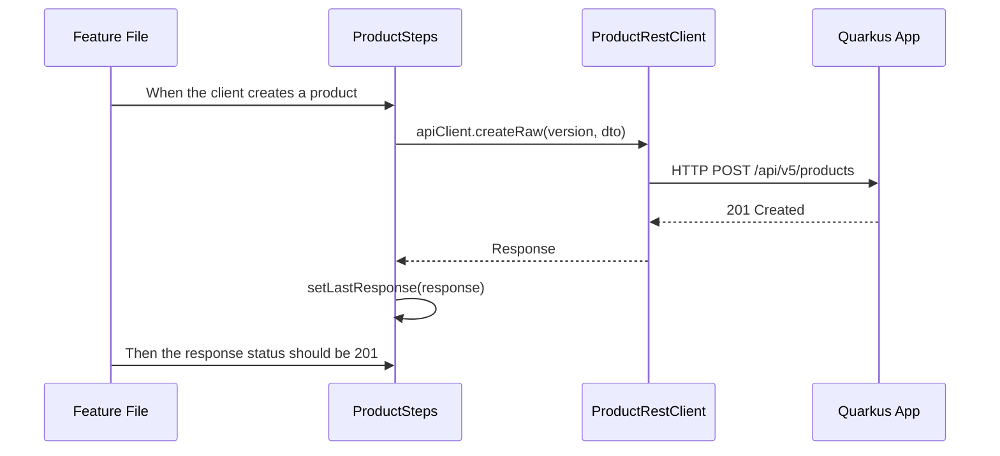

# Testing Overview

A project is not just a collection of files; it is a solution to a business problem. This repository implements a complete Product Vision through a structured hierarchy of requirements.

- Vision: The high-level goal and purpose of the project, describing the value it aims to deliver to users and stakeholders.
  - see [ProductVision.md](ProductVision.md)
- **What (Functional)**: Epics & User Stories:
  - EPIC: A large body of work that can be broken down into smaller tasks (e.g.,  [docs/epics/EPIC-01-product-catalog.md](docs/epics/EPIC-01-product-catalog.md)).
  - User Story: A specific feature or requirement that delivers value to the user (e.g., [docs/user-stories/US-001-product-creation.md](docs/user-stories/US-001-product-creation.md)).
  - Acceptance Criteria: The detailed conditions that must be met for a user story to be considered complete and functional (e.g., [docs/user-stories/US-001-product-creation.md](docs/user-stories/US-001-product-creation.md)).
  - The functional "What." (e.g., US-001: Product Creation).
  - see and [user-stories/](user-stories/)

- **How (Technical)**: NFRs (Non-Functional Requirements): The quality attributes that the system must have, such as performance, security, and maintainabilitye (e.g. [docs/epics/EPIC-01-NFR-technical-specs.md](docs/epics/EPIC-01-NFR-technical-specs.md)

> [!IMPORTANT]
> Each requirement is linked to specific tests that verify its implementation. This ensures that as the code evolves, we can confidently say _"this feature works and meets the specified requirements."_

## Testing Philosophy

Testing is not an afterthought; it is an integral part of the development process. Tests serve multiple purposes:

- **Documentation:** Tests are living documentation that describe how the system should behave under various conditions.
- **Regression Safety:** As the codebase evolves, tests ensure that new changes do not break existing functionality.
- **Design Feedback:** Writing tests, especially unit tests, provides immediate feedback on the design of the code. If a class is hard to test, it may be a sign that it is doing too much or has too many dependencies.
- **Confidence:** A comprehensive test suite gives developers confidence to refactor and improve the code without fear of breaking things.

## Testing Strategy: From Unit to Behavioral Tests

Testing is not just about _"checking if it works"_. It is about **documenting behavior** and ensuring **non-regression** as the architecture evolves.

### The Testing Pyramid

This project follows a balanced testing pyramid:

- **Unit Tests (Fast):** Isolated tests for business logic using Mockito.
- **Integration Tests (Reliable):** Tests that start the Quarkus context and verify the JAX-RS layer.
- **BDD / E2E Tests (Business):** Scenarios that run against a real databaseusing Testcontainers.

### Unit Testing: Business Logic Isolation

Exemple: [src/test/java/org/acme/service/ProductServiceV5Test.java](src/test/java/org/acme/service/ProductServiceV5Test.java)

We test the `ProductServiceV5` in isolation by **mocking** the `ProductRepositoryV5`. This ensures we are testing the service's logic and not the database.

- **Mocking:** We use `@Mock` to simulate repository behavior.
- **Verification:** We use `verify(repository, never()).persist(...)` to ensure that business rules (like SKU uniqueness) prevent invalid data from reaching the database.

### Integration Testing: JAX-RS Layer

Exemple: `src/test/java/org/acme/api/ProductResourceV5IT.java`

Integration tests start the Quarkus application and test the REST endpoints using `RestAssured`. This verifies that our API contracts are correctly implemented and that the application behaves as expected when running.

- **Real HTTP Calls:** We make actual HTTP requests to the endpoints, ensuring that all layers (Resource, Service, Repository) work together.
- **Database Interaction:** These tests interact with a real PostgreSQL database (via Testcontainers),
- **Assertions:** We assert on both the HTTP status codes and the response body to ensure correctness.
- **Negative Testing:** We also test error scenarios, such as trying to create a product with an existing SKU, to ensure our API handles them gracefully.
- **Test Isolation:** Each test method starts with a clean database state, ensuring that tests do not interfere with each other.
- **Performance:** These tests are slower than unit tests but provide higher confidence in the overall system behavior.
- **Test Coverage:** They cover the full stack, from the HTTP layer down to the database, making them essential for catching integration issues.

#### Testcontainers: Realistic Environment

To ensure our tests run in an environment identical to production, we use **Testcontainers** to spin up a real PostgreSQL database for integration and BDD tests. This eliminates the "it works on my machine" problem often encountered with in-memory databases.

### E2E (End-to-End) / BDD (Behavior Driven Development)

We write scenarios in Gherkin syntax that describe the expected behavior of the system from a business perspective. These scenarios are then executed against the running application to verify that the system meets the specified requirements.

- The scenarii are described in gherkin feature files :
  - e.g. [src/test/resources/features/EPIC-01-US-001-product-creation.feature](src/test/resources/features/EPIC-01-US-001-product-creation.feature) associated to the user story US-001-product-creation.
- Each step in the feature file is implemented in Java (e.g., [src/test/java/org/acme/api/cucumber/steps/ProductSteps.java](src/test/java/org/acme/api/cucumber/steps/ProductSteps.java)). These step definitions use the `ProductRestClient` to interact with the API and assert the expected outcomes.

We use the framework Cucumber to run these scenarios, which allows us to maintain **Living Documentation**. The same feature file can be executed against multiple versions of the API, ensuring that as we evolve our API, we do not break existing functionality.

### Summary of Testing Tools

| Tool | Role | Benefit |
| --- | --- | --- |
| **JUnit 5** | Test Runner | Standardized execution and assertions. |
| **Mockito** | Mocking Framework | Isolation of the Service layer from the DB. |
| **Cucumber** | BDD Framework | Readable documentation for business stakeholders. |
| **RestAssured** | HTTP DSL | Easy assertions on JSON responses and status codes. |
| **Testcontainers** | Environment | Containers for real dependencies like databases. |
